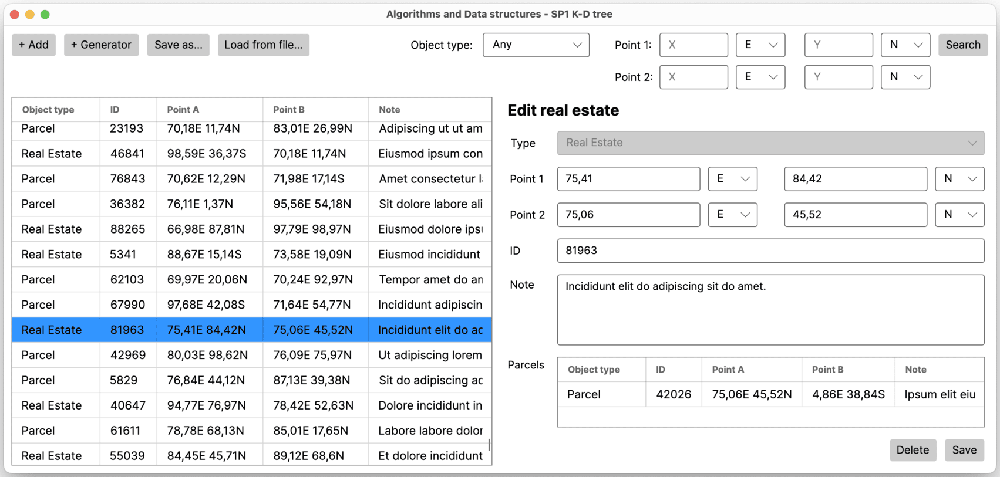
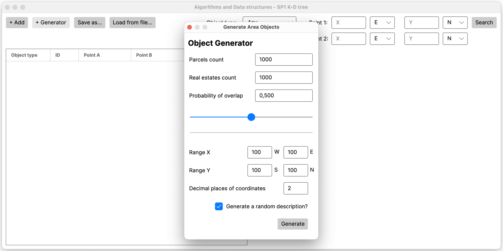
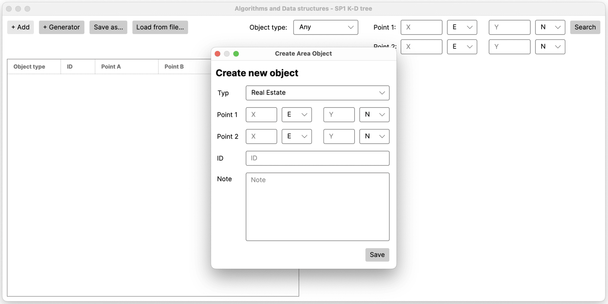
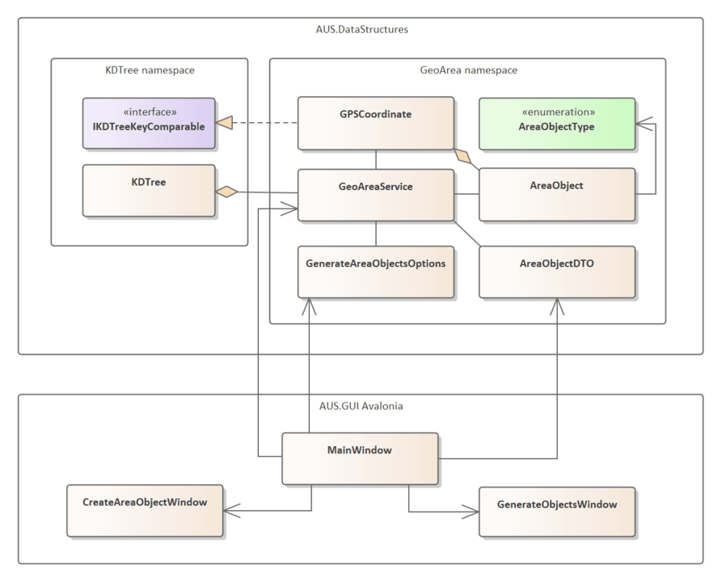
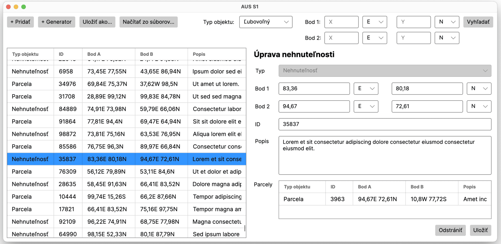
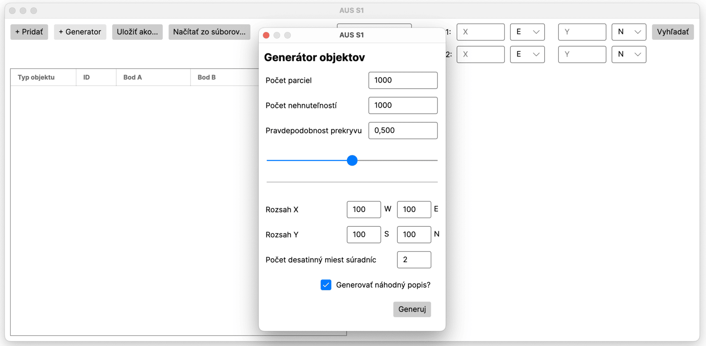
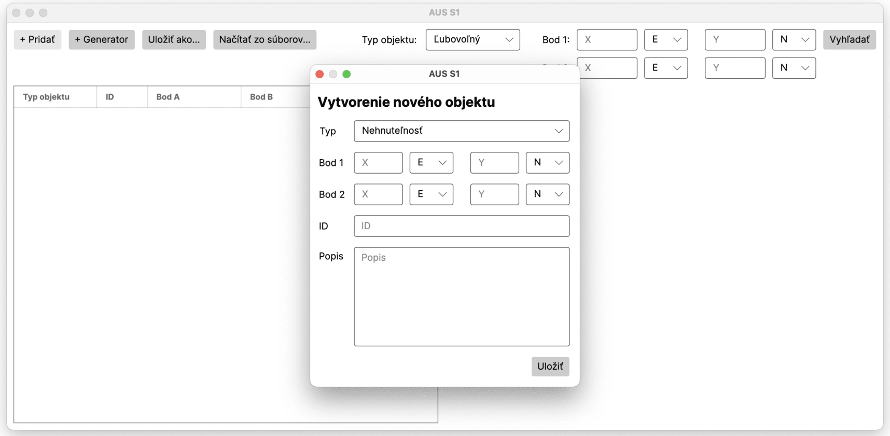

# 🗺️ K-D Tree Data Structure
Custom implementation of a **K-D tree** data structure and its usage in a **Real estate management application**. This project demonstrates efficient spatial data handling using K-D trees, allowing for fast insertion, deletion, and search operations based on GPS coordinates. Application is developed in .NET with Avalonia for the GUI.

The application was developed as the first semester work on the Algorithms and Data structures 2 course at the Faculty of Management Science and Informatics of the University of Žilina.

## 🔎 What is a K-D Tree?
A **K-D tree** (k-dimensional tree) is a space-partitioning data structure for organizing points in a k-dimensional space. It is a binary search tree where every node is a k-dimensional point, and each non-leaf node generates a splitting hyperplane that divides the space into two half-spaces. 

While BST is used for seaching and managing one-dimensional data, K-D trees can handle multi-dimensional data efficiently. 

## 🌟 Features
- ✅ **Efficient Spatial Queries**: Quickly find real estates and parcels based on GPS coordinates.
- ✨ **Dynamic Insertion and Deletion**: Add or remove real estates and parcels while maintaining the tree structure.
- 👨🏻‍💻 **User-Friendly GUI**: Built with Avalonia for a smooth user experience.
- 🗄️ **Data Persistence**: Save and load the state of the application using CSV files.
- 🧪 **Test Cases**: Data structure is tested by automated random operations generator for detecting implementation errors.

 

<em>
    Main application window that displays in left side the list of all real estates and parcels, and in right details of selected real estate or parcel including objects that are intersecting with boundary points.
</em>

<em>
    Window for generating random real estates and parcels, which can be used for testing the application. It is possible to set the number of real estates and parcels, probability of intersection with other objects, domain of coordinates, and more.
</em>

<em>
    Window for adding new real estate or parcel. It allows to enter all necessary data including GPS coordinates of boundary points, which are used for spatial queries.
</em>

## 🛠️ Program Architecture

    
    

        <em>Simplyfied class diagram of the program architecture</em>
    

## 📚 Documentation
[📘 Detailed semester work documentation](docs/documentation.pdf) includes details about:
- K-D tree operations (insert, delete, search) and their implementation
- Architecture of the application
- Aplication features and their complexities
- Saving and loading state of the application

 
 
 

# 🗺️ K-D Strom údajová štruktúra
Vlastná implementácia údajovej štruktúry **K-D strom** a jej použitie v **aplikácii na správu nehnuteľností**. Tento projekt demonštruje efektívnu manipuláciu s priestorovými údajmi pomocou K-D stromov, ktoré umožňujú rýchle vkladanie, mazanie a vyhľadávanie na základe GPS súradníc. Aplikácia je postavená na platforme .NET a Avalonia pre používateľské rozhranie.

Aplikácia bola vytvorená ako prvá semestrálna práca v rámci predmetu Algoritmy a údajové štruktúry 2 na Fakulte riadenia a informatiky Žilinskej univerzity v Žiline.

## 🔎 Čo je to K-D Strom?
**K-D strom** (k-dimenzionálny strom) je údajová štruktúra na rozdelenie priestoru, ktorá spravuje body v k-dimenzionálnom priestore. Ide o binárny vyhľadávací strom, kde každý uzol predstavuje k-dimenzionálny bod a každý ne-listový uzol generuje deliacu hyperrovinu, ktorá rozdeľuje priestor na dva polopriestory.

Zatiaľ čo BVS sa používa na vyhľadávanie a správu jednorozmerných údajov, K-D stromy dokážu efektívne spracovať viacrozmerné údaje.

## 🌟 Funkcie
- ✅ **Efektívne priestorové dotazy**: Rýchle vyhľadávanie nehnuteľností a parciel na základe GPS súradníc.
- ✨ **Dynamické vkladanie a mazanie**: Pridávanie alebo odstraňovanie nehnuteľností a parciel pri zachovaní stromovej štruktúry.
- 👨🏻‍💻 **Používateľsky prívetivé GUI**: Postavené na Avalonii pre plynulý používateľský zážitok.
- 🗄️ **Perzistencia údajov**: Ukladanie a načítanie stavu aplikácie pomocou CSV súborov.
- 🧪 **Testovacie prípady**: Údajová štruktúra je testovaná automatizovaným generátorom náhodných operácií na detekciu chýb v implementácií.

 

<em>
    Hlavné okno aplikácie, ktoré zobrazuje v ľavej časti zoznam všetkých nehnuteľností a parciel a v pravej časti detaily vybranej nehnuteľnosti alebo parcely vrátane objektov, ktoré sa pretínajú s hraničnými bodmi.
</em>

<em>
    Okno pre generovanie náhodných nehnuteľností a parciel, ktoré možno použiť na testovanie aplikácie. Je možné nastaviť počet nehnuteľností a parciel, pravdepodobnosť prekrývania s inými objektmi, doménu súradníc a ďalšie parametre.
</em>

<em>
    Okno pre pridanie novej nehnuteľnosti alebo parcely. Umožňuje zadať všetky potrebné údaje vrátane GPS súradníc hraničných bodov, ktoré sa používajú pri priestorových dotazoch.
</em>

## 🛠️ Architektúra aplikácie

    
    

        <em>Zjednodušený diagram tried architektúry aplikácie</em>
    

## 📚 Dokumentácia
[📘 Podrobná dokumentácia semestrálnej práce](docs/documentation.pdf) obsahuje detaily o:
- Operáciách K-D stromu (vkladanie, mazanie, vyhľadávanie) a ich implementácií
- Architektúre aplikácie
- Funkciách aplikácie a ich zložitostiach
- Ukladaní a načítaní stavu aplikácie
